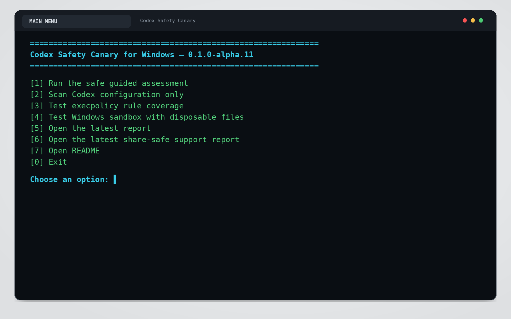
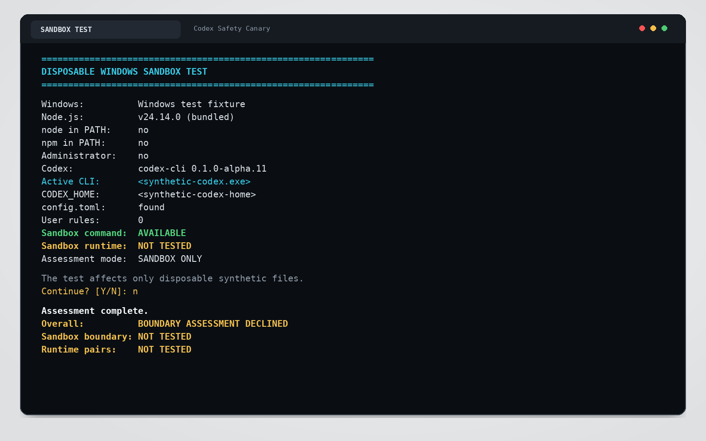
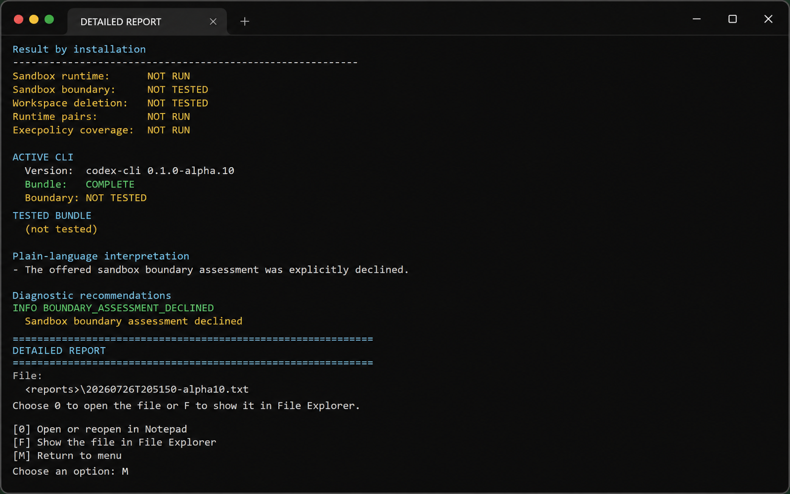
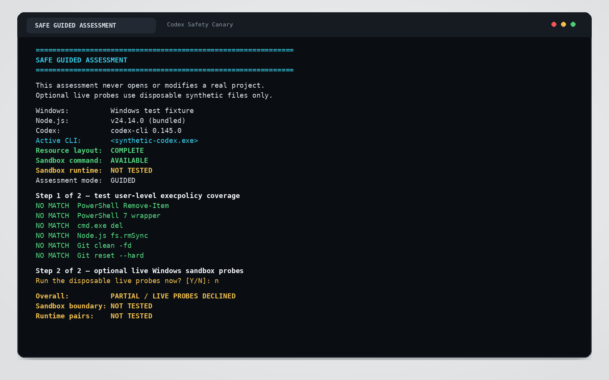
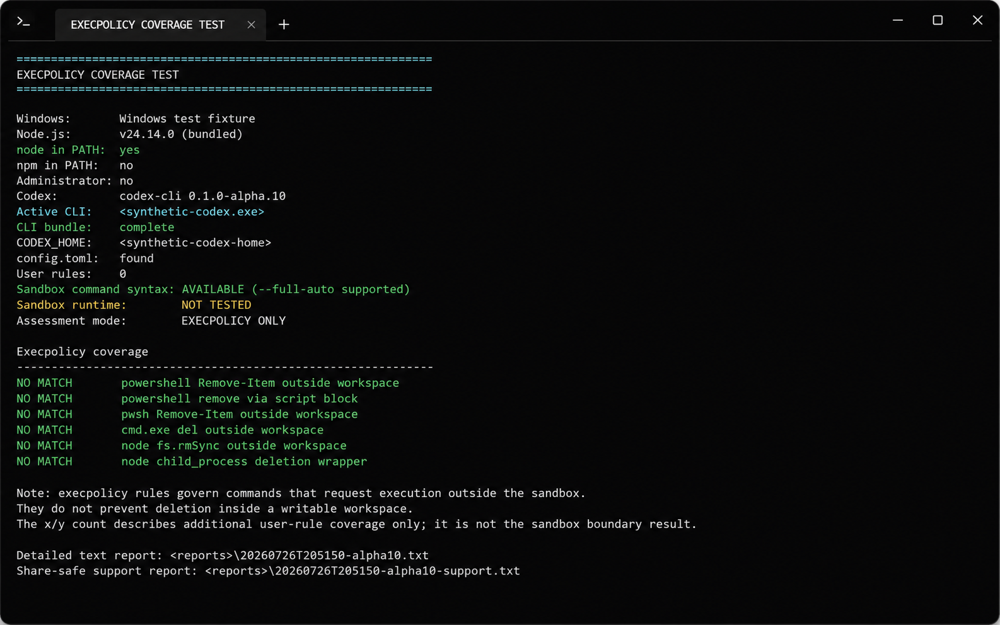
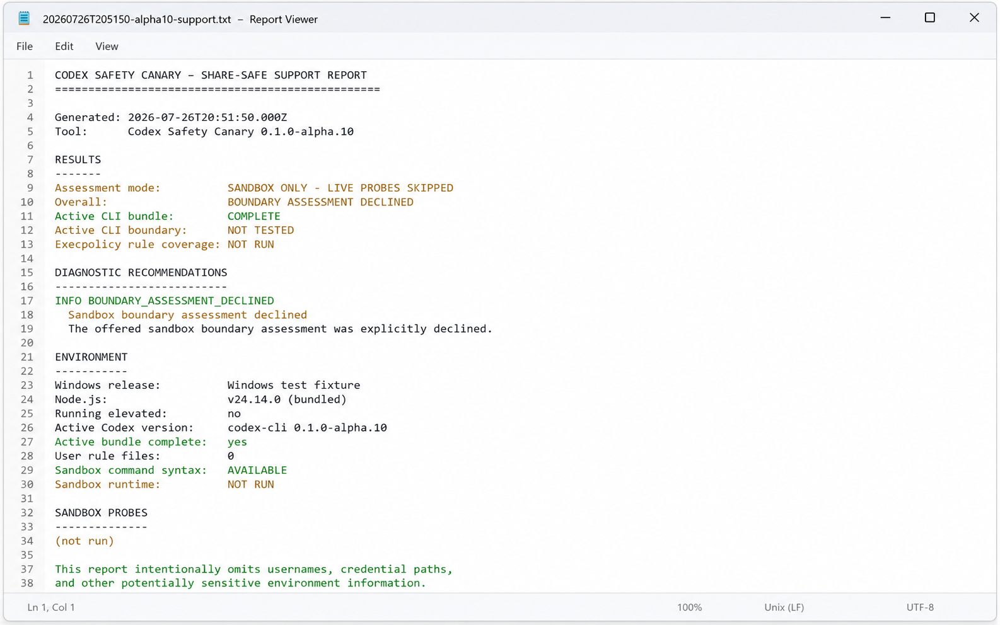
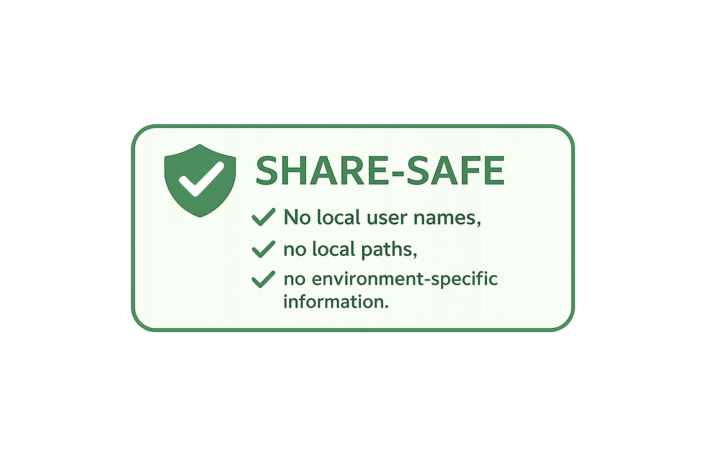

# Codex Safety Canary for Windows

<p align="center">
  
</p>

A local diagnostic that checks whether your current Codex setup actually enforces the Windows sandbox boundary and how your user-level execpolicy rules classify common deletion commands.

It uses only disposable synthetic files. It does **not** open, scan, modify, or delete files from a real project.

> **Version:** 0.1.0-alpha.10
>
> **Alpha status:** This is an early test build. It produces evidence about a specific Codex version and configuration; it does not certify that a computer is secure.
>
> Unofficial project. Not affiliated with, endorsed by, or supported by OpenAI.

## What it looks like



<p>
  
  
</p>

<p>
  
  
</p>

<p>
  
  
</p>

All screenshots contain synthetic or redacted demo data only.

## Why this exists

Codex security has several layers with different jobs:

- the Windows sandbox controls filesystem and network boundaries;
- permission and approval settings control when Codex may proceed or must ask;
- execpolicy rules classify commands that request execution outside the sandbox.

Those layers are easy to confuse. A rule can appear strict while a writable workspace still permits file creation, modification, and deletion. Conversely, a command can fail because the Windows sandbox itself blocked the target path, regardless of how the command was spelled.

Codex Safety Canary reports those distinctions instead of collapsing them into a vague “safe” or “unsafe” result.

## What the alpha tests

### Configuration inventory

The Canary records only selected non-secret facts:

- Windows and Node.js versions;
- Codex CLI version;
- effective `CODEX_HOME`;
- whether `config.toml` and `auth.json` exist;
- selected safety-relevant settings such as `sandbox_mode`, `approval_policy`, `default_permissions`, and `windows.sandbox`;
- user-level `.rules` files under `%CODEX_HOME%\rules`.

It never reads or prints the contents of `auth.json`.

### Execpolicy coverage

Using the official, currently experimental `codex execpolicy check` command, the Canary evaluates common deletion forms against the detected user-level rule files:

- PowerShell `Remove-Item`;
- PowerShell 7 wrapper commands;
- `cmd.exe del`;
- Node.js `fs.rmSync`;
- `git clean -fd`;
- `git reset --hard`.

Execpolicy rules govern commands that request execution outside the sandbox. They do not make files inside a writable workspace undeletable.


### Split-installation diagnosis

On Windows, the `codex.exe` resolved through `PATH` can exist in a different directory from the matching sandbox helper files. The Canary now checks whether the active CLI bundle is complete.

If the active bundle is incomplete, it searches only these known local installation roots:

```text
%LOCALAPPDATA%\OpenAI\Codex\bin
%LOCALAPPDATA%\Programs\OpenAI\Codex\bin
```

A complete same-version bundle is preferred. If none exists, the Canary may separately offer a **newer** complete local bundle whose sandbox command is test-ready. That requires explicit consent and is reported as a version-mismatched alternative test. Its result applies only to the selected alternative bundle; it does not validate the incomplete active CLI resolved through `PATH`.

The Canary uses an alternative executable only for disposable live probes. It does not copy files, modify `PATH`, or change the Codex installation. Older or sandbox-unavailable bundles are not offered.

Before any deletion probe, a harmless sandbox smoke test runs `cmd.exe /c echo` through the selected Codex executable. If sandbox setup fails, no deletion probes are attempted.

### Disposable Windows sandbox probes

The optional live test uses the installed CLI's general `codex sandbox -- <COMMAND>` interface directly. It does not call a model and does not consume Codex tokens.

The Canary creates a temporary workspace and a separate control folder under:

```text
%LOCALAPPDATA%\CodexSafetyCanary\runs\
```

It tests three runtime paths in matched pairs:

- PowerShell deletion inside and outside the workspace;
- `cmd.exe` deletion inside and outside the workspace;
- Node.js filesystem deletion inside and outside the workspace.

The current `codex sandbox` developer command is invoked with the built-in `:workspace` permission profile and the disposable workspace is supplied explicitly with `--cd`. A full boundary pass requires every runtime to delete its inside file and receive access-denied evidence for its outside file. If only some runtime pairs establish the boundary, the result is a partial pass rather than a blanket success. The run folder is removed after the report is written.

## Quick start

Requirements:

- native Windows;
- Codex CLI installed and available as `codex`;
- either Node.js 18 or newer in `PATH`, or the compatible Node runtime bundled by Codex.

Then double-click:

```text
codex-safety-canary.cmd
```

Choose:

```text
[1] Run the safe guided assessment
```

The guided assessment first performs a read-only configuration scan and rule check. Before any live probe, it states exactly where the disposable files will be created and asks for confirmation. If the active CLI bundle is incomplete, a separate confirmation explains any eligible complete local bundle, its version, and the exact executable that would be used. A newer-version alternative is clearly labeled as a separate test that does not validate the active CLI.

Do **not** run the launcher as Administrator. The live test intentionally refuses to run elevated because that would not represent a normal Codex user session.

## Reports

Reports are written outside projects:

```text
%LOCALAPPDATA%\CodexSafetyCanary\reports\
```

Each assessment creates:

- a detailed readable `.txt` report with local diagnostic paths;
- a detailed machine-readable `.json` report;
- a share-safe `-support.txt` report without usernames, executable paths, project paths, credential paths, or raw configuration contents;
- a corresponding share-safe `-support.json` report.

The detailed text report opens automatically in Notepad. Menu option 6 opens the latest share-safe support report. Automatic redaction reduces disclosure risk, but review the support report before attaching it to a public issue.

## Interpreting results

### `PASS`

A complete runtime pair behaved as expected: its inside-workspace file was deleted and its outside-workspace file remained with access-denied evidence.

### `CRITICAL_GAP`

A synthetic file outside the active workspace was deleted. This is a serious boundary failure for the tested configuration and Codex version.

### `EXPECTED`

A file inside the writable workspace was deleted. This demonstrates that workspace-write protects the boundary around a workspace – not every file inside it.

### `PROMPT` or `FORBIDDEN`

The tested command is covered by the detected execpolicy rules when it requests execution outside the sandbox.

### `ALLOW`, `NO_RULES`, or `NO_MATCH`

`NO_MATCH` is a valid execpolicy result: the CLI returned an empty `matchedRules` array and no restrictive rule covered that command. This does not by itself prove a sandbox bypass; rules and filesystem sandboxing are separate layers. A result such as `0/6` describes only additional user-level execpolicy coverage. It is not the sandbox boundary score.


## Active CLI versus tested bundle

The report evaluates installations separately:

```text
ACTIVE CLI
Version:          0.145.0
Bundle:           INCOMPLETE
Boundary status:  NOT TESTED

TESTED BUNDLE
Version:          0.146.0-alpha.3
Bundle:           COMPLETE
Boundary status:  PASS
Methods tested:   3/3
```

A passing alternative bundle does not validate an incomplete `codex.exe` resolved through `PATH`. When a split installation is detected, the report recommends updating or reinstalling the official Codex CLI, opening a new non-administrator PowerShell session, and rerunning the Canary. Do not manually mix helper executables from different Codex versions.

## Boundaries

Codex Safety Canary is:

- a local diagnostic;
- Windows-first;
- Codex CLI-specific in version 0.1 – it does not yet test the desktop app or IDE extension;
- safe by construction with synthetic test files;
- read-only with respect to real projects and Codex credentials.

It is **not**:

- a backup or undelete system;
- a command blocker;
- a replacement for Codex sandboxing or approvals;
- a malware scanner;
- a security certification;
- proof that every possible command form is covered.

The Canary distinguishes a sandbox command that exists from a sandbox runtime that actually starts. A failed helper launch is `TEST ERROR`, never `PASS`.

Results are version-specific. Re-run the Canary after changing Codex, Windows sandbox settings, permission profiles, or rule files.

## Downloaded ZIP blocked by Windows

Windows may mark a downloaded ZIP as originating from the internet. Before extracting it:

1. right-click the ZIP;
2. choose **Properties**;
3. enable **Unblock** / **Zulassen**, if shown;
4. extract the ZIP again.

Do not disable Smart App Control and do not routinely run the launcher as Administrator.

## Official references

- Codex sandbox and approvals: <https://developers.openai.com/codex/agent-approvals-security>
- Codex permissions: <https://developers.openai.com/codex/permissions>
- Codex rules and `execpolicy check`: <https://developers.openai.com/codex/rules>
- Codex CLI reference: <https://developers.openai.com/codex/cli/reference>

## Development

```powershell
npm test
npm run check
```

Automated tests cover parsing, valid execpolicy no-match output, safe path cleanup, selected configuration extraction, rule-decision normalization, version comparison, split-installation bundle selection, fail-closed probe planning, alternative-bundle attribution, separate active/tested-bundle reporting, share-safe report generation, and report semantics. The actual native Windows sandbox can only be validated on a Windows machine with Codex installed.

## License

MIT


### Boundary-test validity

The live test explicitly selects the built-in `:workspace` permission profile and binds it to the disposable workspace. A full boundary pass is valid only when all matched inside/outside runtime pairs behave correctly. Retained files caused by syntax errors or unrelated command failures are reported as test errors, not passes.
