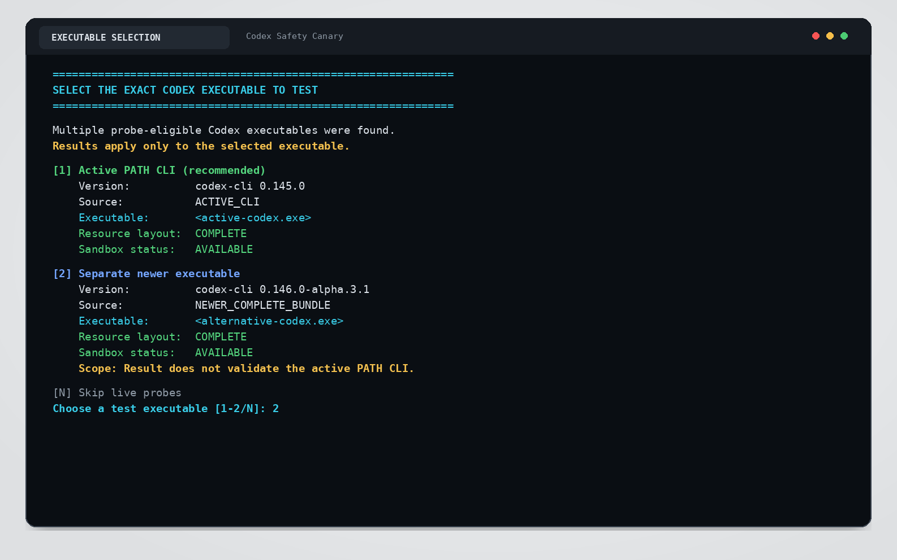
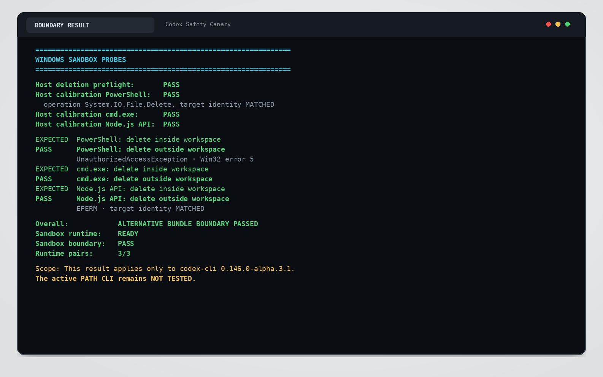
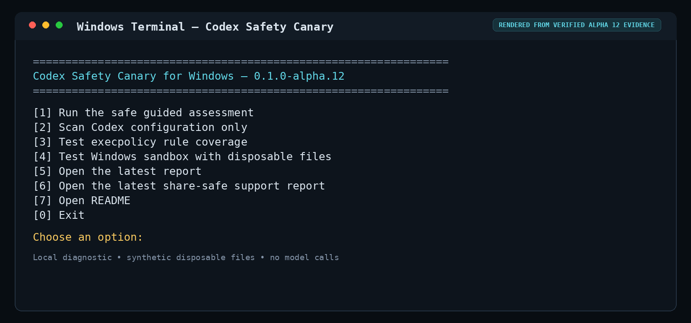
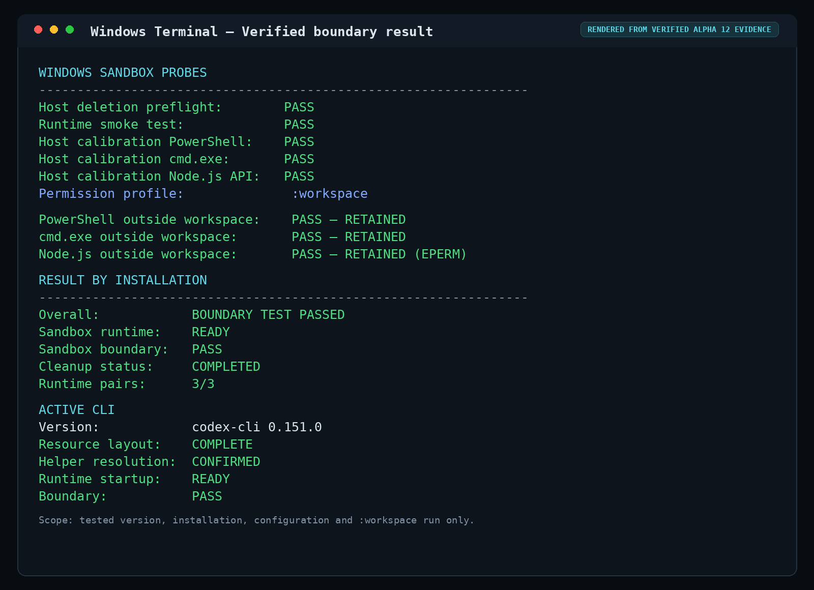
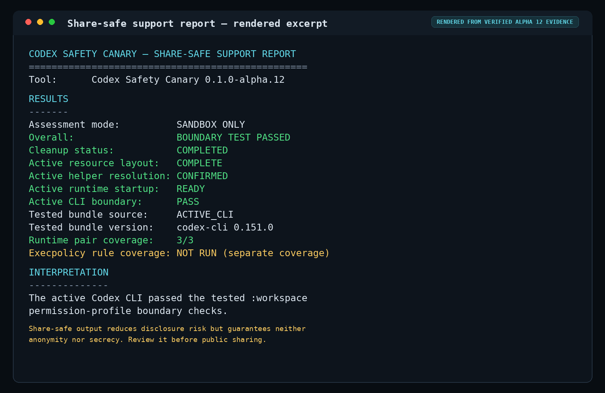

# Codex Safety Canary

<p align="center">
  
</p>

A local diagnostic that checks whether your current Codex setup actually enforces the Windows sandbox boundary and how your user-level execpolicy rules classify common deletion commands.

It uses only disposable synthetic files. It does **not** open, scan, modify, or delete files from a real project.

> **Version:** 0.1.0-alpha.12
>
> **Alpha status:** This is an early test build. It produces evidence about a specific Codex version and configuration; it does not certify that a computer is secure.
>
> Unofficial project. Not affiliated with, endorsed by, or supported by OpenAI.

## What it looks like

<p>
  
</p>

### Safe guided assessment

<p>
  
  
</p>

### Executable selection and bounded evidence

<p>
  
  
</p>

### Sandbox-only decline and detailed report

<p>
  
  
</p>

### Share-safe support output

<p>
  
  
</p>

All screenshots contain synthetic or redacted demo data only.

## Why this exists

Codex uses several safety and execution-control layers, each with a different role:

- the Windows sandbox controls filesystem and network boundaries;
- permission and approval settings control when Codex may proceed or must ask;
- execpolicy rules classify commands that request execution outside the sandbox.

Those layers are easy to confuse. A rule can appear strict while a writable workspace still permits file creation, modification, and deletion. Conversely, a command can fail because the Windows sandbox itself blocked the target path, regardless of how the command was spelled.

Codex Safety Canary reports those distinctions instead of collapsing them into a vague “safe” or “unsafe” result.

## What the alpha tests

### Configuration inventory

The Canary records only selected non-secret facts:

- Windows and Node.js versions;
- Codex CLI version;
- effective `CODEX_HOME`;
- whether `config.toml` and `auth.json` exist;
- selected safety-relevant settings such as `sandbox_mode`, `approval_policy`, `default_permissions`, and `windows.sandbox`;
- user-level `.rules` files under `%CODEX_HOME%\rules`.

It never reads or prints the contents of `auth.json`.

### Execpolicy coverage

Using the official, currently experimental `codex execpolicy check` command, the Canary evaluates common deletion forms against the detected user-level rule files:

- PowerShell `Remove-Item`;
- PowerShell 7 wrapper commands;
- `cmd.exe del`;
- Node.js `fs.rmSync`;
- `git clean -fd`;
- `git reset --hard`.

Execpolicy rules govern commands that request execution outside the sandbox. They do not make files inside a writable workspace undeletable.

The report keeps three facts separate: whether a rule matched the submitted command form, whether that rule is tied to an exact executable path, and whether a later execution actually used that path. A bare command such as `powershell.exe` can match a bare-name rule without proving which executable a later shell invocation resolved. `execpolicy check` classifies the submitted command; it does not execute it and therefore cannot by itself prove execution-path binding or a sandbox boundary result.


## Compatibility overview

Codex Safety Canary distinguishes these installation layouts without repairing or mixing them:

| Layout | What the Canary records | What it does not assume |
| --- | --- | --- |
| Classic bundle | `codex.exe` and sandbox helpers beside the same executable. | A boundary pass without completed live probes. |
| Standalone package | Resources under `%CODEX_HOME%\packages\standalone\current` and `%CODEX_HOME%\packages\standalone\releases\*`. | That the active launcher can resolve those helpers at runtime. |
| Doctor status | `NOT_RUN` when the CLI exists or `UNAVAILABLE` when it does not. This candidate never starts `codex doctor` from a Canary mode. | Any Doctor-derived authentication, runtime, Git, terminal, app, session, network, update, sandbox-readiness, or filesystem-boundary claim. |

For the active PATH CLI, the Canary also detects the sandbox command contract before offering live probes. The currently supported contract is the general `codex sandbox [OPTIONS] [COMMAND]...` interface with `--permission-profile <NAME>` and `--cd <DIR>`. An alternative executable remains filesystem-only until it is selected explicitly; only then may its own `--version` and `sandbox --help` diagnostics establish the invocation plan. An unknown or incomplete help shape remains unsupported and cannot start probes.

### Split-installation diagnosis

On Windows, the `codex.exe` resolved through `PATH` can exist in a different directory from matching sandbox helper files. The Canary records file layout, helper resolution, runtime startup, and boundary evidence separately.

If the active bundle is incomplete, it searches these known local installation roots and standalone package locations:

```text
%LOCALAPPDATA%\OpenAI\Codex\bin
%LOCALAPPDATA%\Programs\OpenAI\Codex\bin
%CODEX_HOME%\packages\standalone\current
%CODEX_HOME%\packages\standalone\releases\*
```

For standalone packages, helper resources such as `codex-windows-sandbox-setup.exe`, `codex-command-runner.exe`, and `rg.exe` are recorded separately from launcher resolution. Resource layout, helper resolution, runtime startup, and boundary verdict are reported as separate states. Alternative executables are deduplicated by provable filesystem identity and are initially recorded only as filesystem discoveries. A package version derived from a release path is labeled as metadata, not executable output. Configuration-only and Execpolicy-only have no executable-selection step and therefore never start an alternative executable.

The Canary may report `STANDALONE_RESOURCES_FOUND`, `SANDBOX_SETUP_HELPER_NOT_RESOLVED`, or `COMMAND_RUNNER_PROCESS_CREATION_FAILED` to separate package inventory from runtime startup. Doctor is skipped by policy, reported as `NOT_RUN` when the active CLI is available or `UNAVAILABLE` when it is not, and contributes no diagnostic or protection evidence. Guided and Sandbox-only may start an alternative executable with `--version` and `sandbox --help` only after the user selects that exact identity. An older, unavailable, changed, syntax-incompatible, version-unparseable, or package-metadata-conflicting selection is rejected before live probes; invalid version evidence stops before `sandbox --help`. The Canary does not copy files, create symlinks, modify `PATH`, run automatic repair, or change the Codex installation.

The Canary first performs its host deletion preflight and calibrates each PowerShell, cmd.exe, and Node.js runner against a synthetic control file outside the Codex sandbox. It then runs a harmless sandbox smoke test with `cmd.exe /c echo` through the selected Codex executable. Only after the smoke succeeds do the paired sandbox deletion probes begin. An outside-boundary PASS requires that method's host calibration to pass. If sandbox setup fails, no sandbox deletion probes are attempted.

### Disposable Windows sandbox probes

The optional live test uses the installed CLI's verified general `codex sandbox [OPTIONS] [COMMAND]...` interface directly. It does not call a model and does not consume Codex tokens.

The Canary creates a temporary workspace and a separate control folder under:

```text
%LOCALAPPDATA%\CodexSafetyCanary\runs\
```

It tests three runtime paths in matched pairs:

- PowerShell deletion inside and outside the workspace;
- `cmd.exe` deletion inside and outside the workspace;
- Node.js filesystem deletion inside and outside the workspace.

The current `codex sandbox` developer command is invoked with the built-in `:workspace` permission profile and the disposable workspace is supplied explicitly with `--cd`. A boundary `PASS` requires the complete structured PowerShell, `cmd.exe`, and Node.js matrix (`3/3`): every runtime must delete its inside file and produce target-bound access-denied evidence for its outside file. Successful individual methods inside an incomplete, interrupted, or contradictory matrix do not establish any boundary protection. Such technical evidence is reported as `TEST ERROR / INCOMPLETE`; `NOT TESTED` means that no boundary conclusion was produced. `PARTIAL` describes only an assessment flow that stopped before live probes, such as an explicit decline, and its boundary remains `NOT TESTED`. The run folder is cleaned up before the final reports are written, so the structured cleanup status is included consistently in every report format.

## Quick start

Requirements to start the Canary:

- native Windows;
- Node.js 18 or newer in `PATH`, or a compatible Node runtime available in a
  recognized Codex desktop runtime cache.

Node.js 22 or 24 is recommended. Node.js 18 and 20 remain compatibility
targets, but both release lines are end-of-life and should not be preferred
for new installations.

For the full Codex assessment, a working Codex CLI callable as `codex` is
required. Alpha 12 may additionally list alternative local executables but never selects one silently.
A list entry is filesystem inventory only: it is not selected,
started, version-confirmed, tested, or evidence about the active CLI or sandbox
boundary.

Then double-click:

```text
codex-safety-canary.cmd
```

Choose:

```text
[1] Run the safe guided assessment
```

The guided assessment first collects configuration inventory and performs the rule check with the active PATH CLI. It does not run `codex doctor`; no Doctor opt-in question appears, and the report records `NOT_RUN` for an available active CLI. Before any live probe, it states exactly where the disposable files will be created and asks for confirmation. Guided and Sandbox-only show the active CLI plus filesystem-discovered, probe-eligible alternatives. Before selection, an alternative shows only its exact path, resource layout, identity status, and any explicitly labeled package-derived version hint; its executable version and sandbox status are still unconfirmed. Selecting an alternative authorizes exactly that bound executable for `--version` and `sandbox --help`; a separate later prompt still controls the disposable live probes. Every alternative result applies only to that executable and never validates the active CLI.

Do **not** run the launcher as Administrator. The live test intentionally refuses to run elevated because that would not represent a normal Codex user session.

## Reports

Reports are written outside projects:

```text
%LOCALAPPDATA%\CodexSafetyCanary\reports\
```

Each assessment creates:

- a detailed readable `.txt` report with local diagnostic paths;
- a detailed machine-readable `.json` report;
- a share-safe `-support.txt` report without usernames, executable paths, project paths, credential paths, or raw configuration contents;
- a corresponding share-safe `-support.json` report.

The Canary also creates or overwrites `latest.json` as a local management pointer to those four files. It contains absolute local paths, is not a share-safe report, and must not be shared. Detailed reports likewise contain local diagnostic paths and are intended for local use. The support reports intentionally retain diagnostic version, installation, runtime, and security-status information needed for troubleshooting. “Share-safe” describes a risk-reduced support representation, not an anonymity or secrecy guarantee, and does not remove all diagnostic host context. After an assessment, the report dialog shows the file path but does not open the detailed report automatically; press `O` to open it in Notepad, `F` to show it in File Explorer, or `M` to return to the menu. Menu options 5 and 6 automatically open the latest detailed or share-safe text report respectively. Automatic redaction reduces disclosure risk, but review the support report before attaching it to a public issue.

## Interpreting results

### `PASS`

A method-level `PASS` means that one complete runtime pair behaved as expected: its inside-workspace file was deleted and its outside-workspace file remained with target-bound access-denied evidence.

An overall sandbox-boundary `PASS` requires the complete structured PowerShell, `cmd.exe`, and Node.js matrix (`3/3`). Successful individual methods inside an incomplete, interrupted, or contradictory matrix do not establish an overall boundary pass.

### `CRITICAL_GAP`

A synthetic file outside the active workspace was deleted. This is a serious boundary failure for the tested configuration and Codex version.

### `EXPECTED`

A file inside the writable workspace was deleted. This demonstrates that workspace-write protects the boundary around a workspace – not every file inside it.

### `PROMPT` or `FORBIDDEN`

The tested command is covered by the detected execpolicy rules when it requests execution outside the sandbox.

### `ALLOW`, `NO_RULES`, or `NO_MATCH`

`NO_MATCH` is a valid execpolicy result: the CLI returned an empty `matchedRules` array and no restrictive rule covered that command. This does not by itself prove a sandbox bypass; rules and filesystem sandboxing are separate layers. A result such as `0/6` describes only additional user-level execpolicy coverage. It is not the sandbox boundary score.

When several supported explicit decisions are present, the Canary evaluates them independently of order and reports the strictest known decision (`forbidden`, then `prompt`, then `allow`). Unknown decision values remain `UNKNOWN_SCHEMA`; they are never normalized to `ALLOW`. Path binding remains a separate evidence field even when a decision is known.


## Alpha 12 Windows verification status

A completed normal-user Windows live run with Canary `0.1.0-alpha.12` tested the active PATH CLI `codex-cli 0.151.0` and recorded resource layout `COMPLETE`, helper resolution `CONFIRMED`, runtime startup `READY`, smoke `PASS`, a complete boundary `3/3` PASS, and cleanup `COMPLETED`; the earlier `0.145.0` run ended before a boundary verdict. This result applies only to the tested Codex version, installation, configuration, and `:workspace` permission-profile run. See the FAQ, changelog, and [Windows test plan](docs/TEST_PLAN.md) for details.

Rendered from verified Alpha 12 evidence for the active PATH CLI `codex-cli 0.151.0` on Windows `10.0.26200` with Node.js `v24.19.0` in a normal non-administrator session under the tested `:workspace` profile; not a raw live capture.

<p>
  
  
  
</p>

## Active CLI versus tested bundle

The report evaluates installations separately. This illustrative split-installation excerpt shows why evidence from an alternative executable remains scoped to that executable:

```text
ACTIVE CLI
Version:            0.145.0
Resource layout:    MISSING
Helper resolution:  NOT_TESTED
Runtime startup:    NOT_TESTED
Boundary status:    NOT TESTED

TESTED BUNDLE
Version:            0.146.0-alpha.3
Resource layout:    COMPLETE
Helper resolution:  CONFIRMED
Runtime startup:    READY
Boundary status:    PASS
Methods tested:     3/3
```

A passing alternative bundle does not validate an incomplete `codex.exe` resolved through `PATH`. When a split installation is detected, the report recommends updating or reinstalling the official Codex CLI, opening a new non-administrator PowerShell session, and rerunning the Canary. Do not manually mix helper executables from different Codex versions.

## Boundaries

Codex Safety Canary is:

- a local diagnostic;
- Windows-first;
- Codex CLI-specific in version 0.1 – it does not yet test the desktop app or IDE extension;
- designed to use only disposable synthetic test files;
- read-only with respect to real projects and Codex credentials.

It is **not**:

- a backup or undelete system;
- a command blocker;
- a replacement for Codex sandboxing or approvals;
- a malware scanner;
- a security certification;
- proof that every possible command form is covered.

The Canary distinguishes a sandbox command that exists from a sandbox runtime that actually starts. A failed helper launch is `TEST ERROR`, never `PASS`.

Results are version-specific. Re-run the Canary after changing Codex, Windows sandbox settings, permission profiles, or rule files.

## Downloaded ZIP blocked by Windows

Windows may mark a downloaded ZIP as originating from the internet. Before extracting it:

1. right-click the ZIP;
2. choose **Properties**;
3. enable **Unblock** / **Zulassen**, if shown;
4. extract the ZIP again.

Do not disable Smart App Control and do not routinely run the launcher as Administrator.

## Official references

- Codex sandbox and approvals: <https://developers.openai.com/codex/agent-approvals-security>
- Codex permissions: <https://developers.openai.com/codex/permissions>
- Codex rules and `execpolicy check`: <https://developers.openai.com/codex/rules>
- Codex CLI reference: <https://developers.openai.com/codex/cli/reference>

## Development

```powershell
npm test
npm run check
```

Automated tests cover parsing, valid execpolicy no-match output, safe path cleanup, selected configuration extraction, rule-decision normalization, version comparison, split-installation bundle selection, fail-closed probe planning, alternative-bundle attribution, separate active/tested-bundle reporting, share-safe report generation, and report semantics. The actual native Windows sandbox can only be validated on a Windows machine with Codex installed.

Versioned offline fixtures under `tests/fixtures/upstream` preserve narrowly scoped synthetic regressions for relevant upstream Codex issues. They document affected versions, inputs, expected states, and evidence limits without requiring live internet access. In particular, [openai/codex#28457](https://github.com/openai/codex/issues/28457) covers split-installation helper resolution, [openai/codex#36179](https://github.com/openai/codex/issues/36179) covers the difference between execpolicy matching and executable-path binding, [openai/codex#41135](https://github.com/openai/codex/issues/41135) keeps unreadable setup-marker evidence separate from runtime proof, and [openai/codex#41278](https://github.com/openai/codex/issues/41278) keeps process start without the expected child marker fail-closed. These regressions do not claim that any issue is present in the currently installed CLI.

The automated CI matrix covers Node.js 18, 20, 22, and 24 on Windows and Ubuntu. Portable tests on Ubuntu exercise parsers, fixtures, reports, and controlled unsupported paths; they do not emulate or validate the native Windows sandbox boundary. See [docs/TEST_PLAN.md](docs/TEST_PLAN.md) for the later manual Windows acceptance and capture checklist.

## License

MIT License. See [LICENSE](LICENSE).
